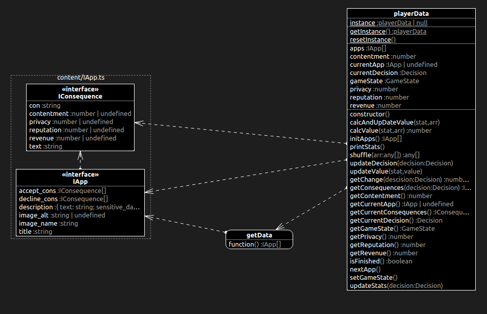

# App Store Ethics: The Game

### **Status**:  <span style="color:lightgreen">*Ongoing*</span> 
<br>

**Project members:**
- [Dadi Andrason](https://github.com/daancs)
- [Emmie Berger](https://github.com/ember97)
- [Julia Böckert](https://github.com/bckert)
- [Steffanie Kristiansson](https://github.com/KristianssonSteffanie)
- [Olivia Månström](https://github.com/olimanstrom)
- [William Johnston](https://github.com/williamProgrammerar)

The current version of this project can be found deployed at https://app-store-ethics.vercel.app/.

## **Description**
This application is a Bachelor's project done at the Department of Computer Science and Engineering at Chalmers University of Technology. The purpose of the project is to create a tool suitable for teaching ethics in a computer science class. The goal of the game is to make students reflect on their choices and get a greater picture of how computer science affects ethical matters in everyday life.


## Technical description

### *Frontend*
This is a [Next.js](https://nextjs.org/) project with TypeScript. \
The project uses [TailWindCSS](https://tailwindcss.com) for CSS styling as it comes with thousands of pre-defined classes for styling with the ability to customise and extend existing classes.

Pages:
- "/", the landing page: describes the game and shows a disclaimer.
- "/game", the game page, shows the app and allows the user to make a choice whether to release the app or decline it.
- "/consequence", shows the consequences of an accept/decline of an app.
- "/endpage", shows whether the player won or lost with the game being over.  
- "/thankyou", a page for thanking the player for playing the game and encourages them to answer our survey


### *Backend*
The backend is written in **Typescript** and purely contains game-logic and data for the game. The apps are currently hard-coded but type-safe and easy to extend with more apps if needed. The backend keeps track of the games current state and the apps and values for the four factors of the game. The following image represents the backend: 




## How to run

First, by using a terminal, install the necessary packages:

```bash
npm install
```
Secondly, run the development server:
```bash
npm run dev
```

Open [http://localhost:3000](http://localhost:3000) with your browser to see the application.

